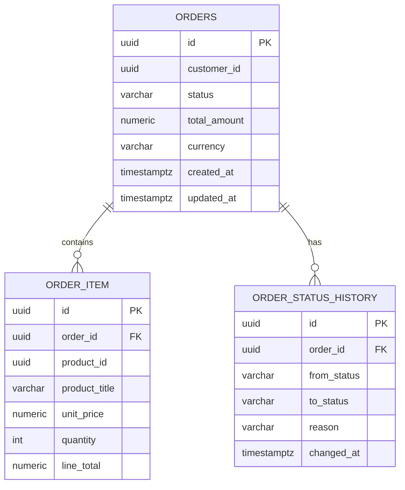
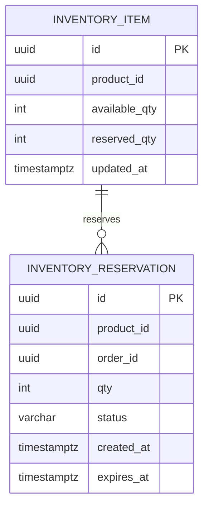
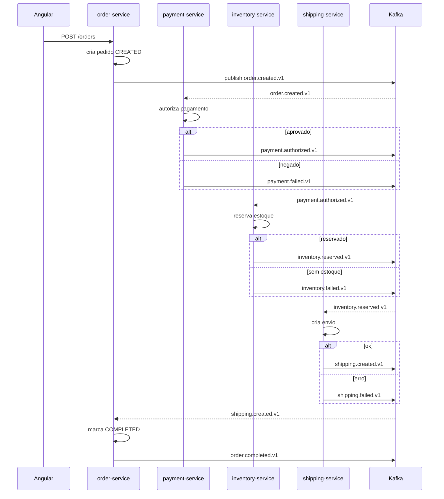

# Mini Mercado Livre — Documentação de Construção (Back-end Java/Spring + Kafka + Redis + Front-end Angular)

## 1) Visão geral
Um mini “Mercado Livre” com fluxo completo de **pedido → pagamento → reserva de estoque → envio**, baseado em **microserviços** e **eventos (Kafka)**, com **front-end Angular**.

**Objetivos de arquitetura:**
- Microserviços independentes e escaláveis
- Comunicação assíncrona via eventos + APIs síncronas quando necessário
- **Idempotência**, **consistência eventual** e **sagas** (orquestrada ou coreografada)
- Observabilidade (logs, métricas, tracing) e testes realistas (Testcontainers)

---

## 2) Stack tecnológica
### Back-end
- **Java 17**
- **Spring Boot 3.5.11**
- Spring Web (REST), Spring Data JPA (Hibernate)
- Spring Security (Resource Server) + **OAuth2/OIDC** (Keycloak)
- **Apache Kafka** (eventos)
- **Redis** (cache + locks + sessão opcional)
- **PostgreSQL** (banco principal por serviço)
- Migrações: **Flyway**

### Front-end
- **Angular 17+**
- OIDC (Keycloak) com biblioteca de autenticação (ex.: angular-oauth2-oidc)
- UI: Angular Material (ou PrimeNG)

### Plataforma
- **Docker** (ambiente local)
- **Kubernetes** (deploy)
- **Terraform** (infra cloud)
- CI/CD: GitHub Actions ou GitLab CI

### Observabilidade
- Micrometer + Prometheus
- OpenTelemetry (tracing) + Jaeger/Tempo
- Logs estruturados + ELK (ou Loki)

---

## 3) Arquitetura de microserviços
### Serviços
1. **api-gateway** (opcional, recomendado)
2. **auth** (Keycloak fora do domínio, mas faz parte do ecossistema)
3. **catalog-service** (produtos)
4. **order-service** (carrinho/pedido)
5. **payment-service** (pagamento)
6. **inventory-service** (estoque)
7. **shipping-service** (envio)
8. **notification-service** (e-mail/whatsapp mock)

### Domínios e responsabilidade
- **catalog-service**: CRUD de produtos, preço, imagens, categorias
- **order-service**: cria e gerencia pedidos (status), calcula total
- **payment-service**: autorização/captura (mock gateway), antifraude simples
- **inventory-service**: reserva/baixa estoque e controla concorrência
- **shipping-service**: cálculo de frete e rastreio (mock)
- **notification-service**: envia notificações com base em eventos

### Comunicação
- **Síncrona (REST)**: UI → gateway → serviços (consultas e comandos)
- **Assíncrona (Kafka)**: eventos de domínio para sincronizar estados (padrão coreografado)

---

## 4) Modelagem de dados (banco por serviço)
**Regra:** cada microserviço é dono do seu banco (database-per-service). Integrações entre domínios são via eventos.

### 4.1 catalog-service (Postgres)
- `product` (produto)
- `product_image`
- `category`

### 4.2 order-service (Postgres)
- `orders`
- `order_item`
- `order_status_history`
- `outbox_event` (para o padrão Outbox)

### 4.3 payment-service (Postgres)
- `payment`
- `payment_attempt`
- `outbox_event`

### 4.4 inventory-service (Postgres)
- `inventory_item` (saldo por SKU)
- `inventory_reservation`
- `outbox_event`

### 4.5 shipping-service (Postgres)
- `shipment`
- `shipment_event`
- `outbox_event`

### ERD do order-service (Mermaid)


### ERD do inventory-service (Mermaid)


> **Observação:** `product_id` é o identificador de referência compartilhado (ID do produto). Não há FK entre bancos.

---

## 5) Fluxo principal (Saga coreografada)
### Estados do pedido (order-service)
- `CREATED` → `PAYMENT_PENDING` → `PAID` → `INVENTORY_RESERVED` → `SHIPPING_CREATED` → `COMPLETED`
- Falhas: `PAYMENT_FAILED`, `CANCELLED`, `INVENTORY_FAILED`, `SHIPPING_FAILED`

### Eventos Kafka (padrão)
- `order.created.v1`
- `payment.authorized.v1`
- `payment.failed.v1`
- `inventory.reserved.v1`
- `inventory.failed.v1`
- `shipping.created.v1`
- `shipping.failed.v1`
- `order.completed.v1`

### Sequência (Mermaid)


### Compensações
- Se `payment.failed`: order-service marca `PAYMENT_FAILED` (sem compensação)
- Se `inventory.failed`: order-service marca `INVENTORY_FAILED` e payment-service pode receber comando/evento de **refund** (opcional)
- Se `shipping.failed`: order-service marca `SHIPPING_FAILED` e inventory-service pode liberar reserva (evento de compensação)

---

## 6) Padrões obrigatórios (para ficar “sênior”)
### 6.1 Idempotência
- Consumidores Kafka devem tratar reprocessamento.
- Use `event_id` + tabela de **inbox/processed_events** por consumidor.

### 6.2 Outbox Pattern (recomendado)
Para evitar “salvei no banco mas não publiquei no Kafka”:
- Serviço grava `outbox_event` na mesma transação do domínio
- Um job/worker publica eventos e marca como `SENT`

Tabela exemplo:
- `outbox_event(id, aggregate_id, type, payload_json, status, created_at)`

### 6.3 Versionamento de eventos
- Tópicos versionados (`*.v1`, `*.v2`) ou schema registry.

---

## 7) APIs (REST) — contratos principais
### catalog-service
- `GET /products?query=&category=&page=&size=`
- `GET /products/{id}`

### order-service
- `POST /orders` (criar pedido)
- `GET /orders/{id}`
- `GET /orders?status=&page=&size=`

Payload create order (exemplo):
```json
{
  "customerId": "uuid",
  "items": [
    {"productId": "uuid", "quantity": 2}
  ]
}
```

### payment-service
- `GET /payments/{orderId}` (consulta)

### shipping-service
- `GET /shipments/{orderId}`

---

## 8) Segurança (OAuth2/OIDC)
- Frontend obtém token no **Keycloak** (Authorization Code + PKCE)
- Gateway e/ou serviços validam JWT como **Resource Server**
- Claims/roles:
  - `ROLE_USER` (comprador)
  - `ROLE_ADMIN` (admin catálogo)

---

## 9) Front-end Angular
### 9.1 Telas
1. Login
2. Listagem de produtos (busca + filtros)
3. Detalhe do produto
4. Carrinho
5. Checkout (criar pedido)
6. Acompanhamento do pedido (status em tempo real — polling ou SSE)

### 9.2 Arquitetura do projeto
- `core/` (auth, interceptors, guards, config)
- `shared/` (components, pipes, utils)
- `features/`
  - `catalog/`
  - `cart/`
  - `checkout/`
  - `orders/`

### 9.3 Integração com APIs
- `HttpInterceptor` para anexar `Authorization: Bearer <token>`
- Serviços Angular:
  - `CatalogApiService`
  - `OrderApiService`
  - `PaymentApiService`
  - `ShippingApiService`

### 9.4 Tempo real (opções)
- **Opção A (simples):** polling no `GET /orders/{id}` a cada 2–3s
- **Opção B (melhor):** SSE/WebSocket no gateway (order-service emite status)

---

## 10) Ambiente local (Docker Compose)
**Containers:**
- Postgres (um por serviço ou schemas separados)
- Kafka + Zookeeper (ou Redpanda)
- Redis
- Keycloak
- Serviços Spring Boot
- Angular (opcional em container)

Estrutura recomendada:
- `infra/docker-compose.yml`
- `services/*`
- `frontend/*`

---

## 11) Deploy (Kubernetes)
- Namespace `mini-ml`
- Deployments e Services para cada microserviço
- Config via ConfigMap/Secret
- Ingress (Nginx) para o gateway
- HPA (auto scale) para order/payment/inventory

---

## 13) Observabilidade
### Métricas
- Latência p95/p99 por endpoint
- Taxa de erro 4xx/5xx
- Lag do consumidor Kafka

### Tracing
- Propagação de `traceparent` (W3C)
- Correlation id em logs

### Logs
- JSON logs com `traceId`, `spanId`, `orderId`

---

## 14) Testes
### Unitários
- JUnit 5 + Mockito

### Integração (Testcontainers)
- Postgres
- Kafka
- Redis

### Contrato
- OpenAPI (Swagger) e testes de contrato (opcional)

---

## 15) Roadmap (passo a passo de construção)
1. **Infra local** (compose: Postgres, Kafka, Redis, Keycloak)
2. **catalog-service** (CRUD + busca simples)
3. **order-service** (criar pedido + status)
4. **payment-service** (consome order.created, emite approved/failed)
5. **inventory-service** (reserva com lock/otimista + emite reserved/failed)
6. **shipping-service** (cria envio)
7. **notification-service** (mock)
8. **Observabilidade** (Actuator, Prometheus, tracing)
9. **Testcontainers** e pipeline CI
10. **Angular** (telas principais + autenticação)
11. **K8s deploy**
12. **Terraform** (cloud)

---

## 16) Requisitos não-funcionais e boas práticas
- APIs com paginação/ordenacão
- Validações e erros padronizados (RFC 7807 opcional)
- Resiliência: timeouts, retries (Resilience4j)
- Segurança: validação de token, CORS, rate limit no gateway
- Documentação: OpenAPI por serviço + README principal

---

## 17) Extras que valorizam o projeto
- **Feature flags** (ex.: Unleash)
- **Schema Registry** para eventos
- **Dead Letter Topic (DLT)** e reprocessamento
- **Painel admin** (CRUD catálogo) com role ADMIN

---

## Apêndice A — Convenções
- Naming de tópicos: `{domain}.{event}.v{n}`
- Correlation: `X-Correlation-Id` em chamadas HTTP + em eventos Kafka
- IDs: UUID

## Apêndice B — Sugestão de repositório
- Monorepo:
  - `/services/catalog-service`
  - `/services/order-service`
  - `/services/payment-service`
  - `/services/inventory-service`
  - `/services/shipping-service`
  - `/services/notification-service`
  - `/frontend/angular-app`
  - `/infra/docker`
  - `/infra/k8s`
  - `/infra/terraform`

---